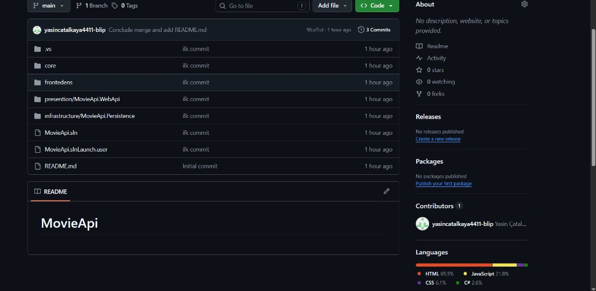

# MovieApi

[](https://dotnet.microsoft.com/)
[](https://learn.microsoft.com/aspnet/core)
[](https://learn.microsoft.com/ef/core/)
[](#)

TR | [EN](#english)

## Turkce

### Icindekiler

- [Ekran Goruntusu](#ekran-goruntusu)
- [Proje Mimarisi](#proje-mimarisi)
- [Kullanilan Teknolojiler](#kullanilan-teknolojiler)
- [Gereksinimler](#gereksinimler)
- [Baslangic](#baslangic)
- [Projeleri Calistirma](#projeleri-calistirma)
- [Ornek API Endpointleri](#ornek-api-endpointleri)
- [Gelistirme Notlari](#gelistirme-notlari)
- [Bilinen Sorunlar](#bilinen-sorunlar)
- [Yol Haritasi](#yol-haritasi)
- [Katki](#katki)
- [Lisans](#lisans)

MovieApi, katmanli mimari ile gelistirilmis bir film yonetim projesidir.
Projede API katmani, MVC Web UI katmani, application/domain katmanlari ve persistence katmani bir arada kullanilir.

## Ekran Goruntusu

Asagidaki gorseli kendi ekran goruntun ile degistirebilirsin:



## Proje Mimarisi

```
MovieApi
|- core
|  |- MovieApi.Application
|  |- MovieApi.domain
|- infrastructure
|  |- MovieApi.Persistence
|- presention
|  |- MovieApi.WebApi
|- frontedens
|  |- Movie.Api.WebUI
|  |- MovieApi.Dto
```

## Kullanilan Teknolojiler

- .NET 9
- ASP.NET Core Web API
- ASP.NET Core MVC
- Entity Framework Core
- SQL Server
- MediatR

## Gereksinimler

- .NET 9 SDK
- SQL Server (veya LocalDB)
- Visual Studio 2022 (onerilir)

## Baslangic

1. Repoyu klonlayin:

```bash
git clone <repo-url>
cd MovieApi
```

2. NuGet paketlerini geri yukleyin:

```bash
dotnet restore
```

3. Cozumu derleyin:

```bash
dotnet build MovieApi.sln
```

## Projeleri Calistirma

Bu yapida iki ana proje birlikte calisir:

- `presention/MovieApi.WebApi`
- `frontedens/Movie.Api.WebUI`

### 1) Web API

```bash
dotnet run --project presention/MovieApi.WebApi
```

Varsayilan adresler:
- `https://localhost:7163`
- `http://localhost:5094`

### 2) Web UI

```bash
dotnet run --project frontedens/Movie.Api.WebUI
```

Varsayilan adresler:
- `https://localhost:7280`
- `http://localhost:5259`

Web UI, API'ye `frontedens/Movie.Api.WebUI/appsettings.json` dosyasindaki `ApiSettings:BaseUrl` degeri ile baglanir.

## Ornek API Endpointleri

Base URL:

- `https://localhost:7163`

Swagger:

- `https://localhost:7163/swagger/index.html`

Sik kullanilan endpointler:

- `GET /api/Movies`
- `GET /api/Movies/getmovie?id=1`
- `GET /api/Movies/getmoviewithcategory`
- `POST /api/Movies`
- `PUT /api/Movies`
- `DELETE /api/Movies?id=1`
- `GET /api/Categories`
- `GET /api/Categories/GetCategory?id=1`
- `POST /api/Categories`
- `PUT /api/Categories`
- `DELETE /api/Categories?id=1`
- `GET /api/Serieses`
- `GET /api/Serieses/getSeries?id=1`
- `GET /api/Serieses/getSeriesWithCategory`
- `GET /api/Tags`
- `GET /api/Casts`
- `GET /api/Reviews?page=1&pageSize=10`
- `POST /api/Registers`
- `POST /api/Registers/bulk`

Kisa `curl` ornekleri:

```bash
curl -X GET "https://localhost:7163/api/Movies"
```

```bash
curl -X GET "https://localhost:7163/api/Reviews?page=1&pageSize=10"
```

## Gelistirme Notlari

- Proje klasor isimlerinde yazim farklari vardir (`presention`, `frontedens`, `MovieApi.domain`). Bu adlar cozum dosyasinda da ayni sekilde tanimlidir.
- Yeni bir ortamda calisirken SSL sertifikasi uyarisi alirsaniz `dotnet dev-certs https --trust` komutunu calistirabilirsiniz.

## Bilinen Sorunlar

- UI tarafinda layout yolu ile ilgili hatalar olusabilir. Ozellikle `~/Views/AdminLayout/Index.cshtml` dosya yolu kontrol edilmelidir.
- Projedeki klasor isimlerinde yazim farklari (`presention`, `frontedens`) yeni gelistiriciler icin kafa karistirici olabilir.
- API tarafinda birkac endpoint adlandirmasi standart REST isimlendirmesinden farkli olabilir (`getmovie`, `GetCategory` gibi).

## Yol Haritasi

- Endpoint adlarini daha tutarli hale getirip REST standartlarina yaklastirmak.
- `README` icin Postman collection veya OpenAPI export baglantisi eklemek.
- Temel bir test katmani (unit/integration) olusturmak.
- Docker ile gelistirme ortami ve tek komutta ayaga kaldirma destegi eklemek.

## Katki

1. Yeni bir branch olusturun.
2. Degisikliklerinizi yapin.
3. Commit atin ve pull request gonderin.

## Lisans

Bu proje egitim amaclidir. Lisans bilgisi eklemek isterseniz bu bolumu guncelleyebilirsiniz.

---

## English

### Table of Contents

- [Screenshot](#screenshot)
- [Project Architecture](#project-architecture)
- [Tech Stack](#tech-stack)
- [Requirements](#requirements)
- [Getting Started](#getting-started)
- [Run the Projects](#run-the-projects)
- [Sample API Endpoints](#sample-api-endpoints)
- [Development Notes](#development-notes)
- [Known Issues](#known-issues)
- [Roadmap](#roadmap)
- [Contributing](#contributing)
- [License](#license)

MovieApi is a movie management project built with a layered architecture.
The solution includes an API layer, an MVC Web UI layer, application/domain layers, and a persistence layer.

## Screenshot

You can replace this image with your own project screenshot:


## Project Architecture

```
MovieApi
|- core
|  |- MovieApi.Application
|  |- MovieApi.domain
|- infrastructure
|  |- MovieApi.Persistence
|- presention
|  |- MovieApi.WebApi
|- frontedens
|  |- Movie.Api.WebUI
|  |- MovieApi.Dto
```

## Tech Stack

- .NET 9
- ASP.NET Core Web API
- ASP.NET Core MVC
- Entity Framework Core
- SQL Server
- MediatR

## Requirements

- .NET 9 SDK
- SQL Server (or LocalDB)
- Visual Studio 2022 (recommended)

## Getting Started

1. Clone the repository:

```bash
git clone <repo-url>
cd MovieApi
```

2. Restore NuGet packages:

```bash
dotnet restore
```

3. Build the solution:

```bash
dotnet build MovieApi.sln
```

## Run the Projects

Two main projects run together in this setup:

- `presention/MovieApi.WebApi`
- `frontedens/Movie.Api.WebUI`

### 1) Web API

```bash
dotnet run --project presention/MovieApi.WebApi
```

Default URLs:
- `https://localhost:7163`
- `http://localhost:5094`

### 2) Web UI

```bash
dotnet run --project frontedens/Movie.Api.WebUI
```

Default URLs:
- `https://localhost:7280`
- `http://localhost:5259`

Web UI connects to the API using `ApiSettings:BaseUrl` in `frontedens/Movie.Api.WebUI/appsettings.json`.

## Sample API Endpoints

Base URL:

- `https://localhost:7163`

Swagger:

- `https://localhost:7163/swagger/index.html`

Common endpoints:

- `GET /api/Movies`
- `GET /api/Movies/getmovie?id=1`
- `GET /api/Movies/getmoviewithcategory`
- `POST /api/Movies`
- `PUT /api/Movies`
- `DELETE /api/Movies?id=1`
- `GET /api/Categories`
- `GET /api/Categories/GetCategory?id=1`
- `POST /api/Categories`
- `PUT /api/Categories`
- `DELETE /api/Categories?id=1`
- `GET /api/Serieses`
- `GET /api/Serieses/getSeries?id=1`
- `GET /api/Serieses/getSeriesWithCategory`
- `GET /api/Tags`
- `GET /api/Casts`
- `GET /api/Reviews?page=1&pageSize=10`
- `POST /api/Registers`
- `POST /api/Registers/bulk`

Quick `curl` examples:

```bash
curl -X GET "https://localhost:7163/api/Movies"
```

```bash
curl -X GET "https://localhost:7163/api/Reviews?page=1&pageSize=10"
```

## Development Notes

- There are intentional spelling differences in folder names (`presention`, `frontedens`, `MovieApi.domain`). These are also referenced the same way in the solution file.
- If you get an HTTPS development certificate warning, run `dotnet dev-certs https --trust`.

## Known Issues

- UI can throw layout-path related errors. In particular, verify the `~/Views/AdminLayout/Index.cshtml` path.
- Folder naming differences (`presention`, `frontedens`) may be confusing for new contributors.
- Some API endpoint naming does not fully follow REST naming conventions (`getmovie`, `GetCategory`, etc.).

## Roadmap

- Improve endpoint naming consistency to better align with REST conventions.
- Add a Postman collection or OpenAPI export link to the `README`.
- Introduce a basic testing layer (unit/integration tests).
- Add Docker support for easier local setup and one-command startup.

## Contributing

1. Create a new branch.
2. Make your changes.
3. Commit and open a pull request.

## License

This project is for educational purposes. You can update this section if you want to add a specific license.